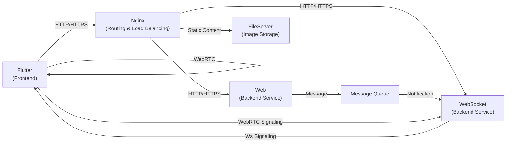
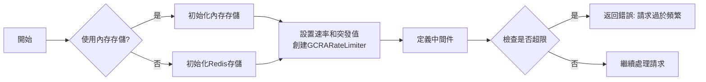
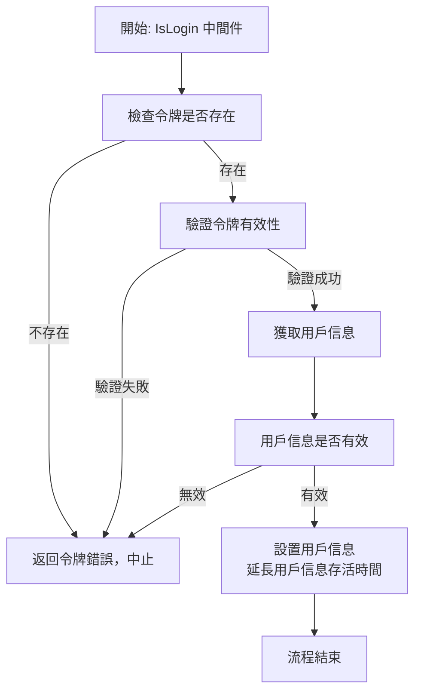

[TOC]

# im
instant message project

## 預計架構

- 實現下方WebRTC, Web, WebSocket端a



## 程序業務

### 中間件


#### RouteCache 

- 路由根據url設定緩存
- 設置RouteCache不會有route參數以外的其餘參數
- 流程圖
  ```mermaid
  graph TD;
  C[嘗試獲取緩存數據]
  C -->|緩存命中| D[返回緩存數據並中止]
  C -->|緩存未命中| E["進入SingleFlight (Redis級別)"]
  E --> F[嘗試獲取Redis數據]
  F -->|Redis命中| G[設置緩存數據, 返回Redis數據]
  F -->|Redis未命中| H["進入SingleFlight (DB級別)"]
  H --> I[獲取DB數據]
  I --> J[設置Redis和緩存數據]
  J --> K[返回DB數據]
  ```

#### Ratelimit

- 限制用戶ip登入次數
- 視條件更改所有


#### 登入驗證(JWT)



## API List

### User

1. `POST` `/im/users/register`: 註冊新用戶。
1. `POST` `/im/users/login`: 用戶登錄並返回授權令牌。
1. `GET` `/im/users/logout`: 用戶登出。
1. `GET` `/im/users/{id}`: 獲取指定ID的用戶詳細信息。
1. `PUT` `/im/users/{id}`: 更新指定ID的用戶信息。
1. `DELETE` `/im/users/{id}`: 刪除指定ID的用戶。
1. `GET` `/im/users/search?query={query}`: 根據查詢條件搜索用戶。
1. `GET` `/im/users/{id}/online-status`：獲取指定用戶ID的在線狀態。
1. `PUT` `/im/users/{id}/online-status`：更新指定用戶ID的在線狀態（例如，上線、離線、隱身等）。

### Friends

1. `GET` `/im/users/friends`: 獲取用戶的好友列表。
1. `POST` `/im/users/friends`: 向指定用戶發送好友請求。
1. `PUT` `/im/users/friends`: 更新與指定用戶的好友關係（接受/拒絕/阻止）。
1. `DELETE` `/im/users/friends`: 刪除與指定用戶的好友關係。
1. `GET` `/im/users/friend-requests`：獲取指定用戶ID收到的好友請求列表。
1. `POST` `/im/users/friend-requests`：讓指定的requester-id向指定用戶ID發送好友請求。
1. `PUT` `/im/users/friend-requests`：指定用戶ID接受或拒絕來自requester-id的好友請求。
1. `GET` `/im/users/blocked-friends`：獲取指定用戶ID的已封鎖好友列表。
1. `PUT` `/im/users/blocked-friends`：指定用戶ID封鎖或取消封鎖指定好友ID。
1. `GET` `/im/users/mutual-friends`：獲取指定用戶ID與另一指定用戶ID的共同好友列表。

### Group
1. `GET` `/im/users/{id}/groups`: 獲取用戶所屬的群組列表。
1. `POST` `/im/groups`：創建新群組。
1. `GET` `/im/groups/{id}`：根據群組ID獲取群組資訊。
1. `PUT` `/im/groups/{id}`：更新指定群組ID的群組資訊。
1. `DELETE` `/im/groups/{id}`：刪除指定群組ID的群組。
1. `GET` `/im/groups/{id}/members`：獲取指定群組ID的成員列表。
1. `POST` `/im/groups/{id}/members/{user-id}`：將指定用戶ID添加到指定群組ID。
1. `DELETE` `/im/groups/{id}/members/{user-id}`：將指定用戶ID從指定群組ID中移除。
1. `GET` `/im/groups/{id}/invitations`：獲取指定群組ID的未處理邀請列表。
1. `POST` `/im/groups/{id}/invitations/{user-id}`：向指定用戶ID發送指定群組ID的邀請。
1. `PUT` `/im/groups/{id}/invitations/{user-id}`：指定用戶ID接受或拒絕來自指定群組ID的邀請。
1. `DELETE` `/im/groups/{id}/invitations/{user-id}`：刪除來自指定群組ID的邀請。
1. `GET` `/im/groups/{id}/requests`：獲取指定群組ID的加入請求列表。
1. `POST` `/im/groups/{id}/requests/{user-id}`：指定用戶ID向指定群組ID發送加入請求。
1. `PUT` `/im/groups/{id}/requests/{user-id}`：指定群組ID接受或拒絕來自指定用戶ID的加入請求。
1. `DELETE` `/im/groups/{id}/requests/{user-id}`：刪除來自指定用戶ID的加入請求。
1. `GET` `/im/groups/search?query={search-query}`：根據搜索條件（例如群組名稱）查找群組。
1. `POST` `/im/private-messages/{message-id}/reactions`：為指定私人訊息ID添加表情符號或反應。
1. `DELETE` `/im/private-messages/{message-id}/reactions/{reaction-id}`：刪除指定私人訊息ID的表情符號或反應。

### Group Message

1. `GET` `/im/users/{id}/group-messages`：獲取指定用戶ID的所有私人訊息列表。
1. `GET` `/im/groups/{id}/messages`：獲取指定群組ID的所有訊息列表。
1. `POST` `/im/groups/{id}/messages`：向指定群組ID發送訊息。
1. `PUT` `/im/group-messages/{message-id}`：更新指定群組訊息ID的訊息內容（例如，標記為已讀）。
1. `DELETE` `/im/group-messages/{message-id}`：刪除指定群組訊息ID的訊息。
1. `GET` `/im/group-messages/{message-id}`：根據群組訊息ID獲取訊息詳情。
1. `POST` `/im/group-messages/{message-id}/reactions`：為指定群組訊息ID添加表情符號或反應。
1. `DELETE` `/im/group-messages/{message-id}/reactions/{reaction-id}`：刪除指定群組訊息ID的表情符號或反應。

## note

- 後台與前台API共用, 中間件檢測API權限(如A的好友列表只能由A確認)


## project structure

```
├─api
├─cmd
├─deployments
├─docs
│  └─sql
│      └─init
├─internal
│  ├─consts
│  ├─handler
│  ├─models
│  ├─repo
│  └─service
├─pkg
│  ├─config
│  ├─helper
│  ├─https
│  └─log
└─scripts
```

## 套件安裝

- 快速產生套件

```shell
go install github.com/rickylin614/nunu@v1.0.4

go install github.com/vektra/mockery/v2@v2.36.0

go install github.com/swaggo/swag/cmd/swag@v1.16.1
```

-- v2.36.0

## 執行時標籤

- 使gin的json編碼使用非基礎套件:
  - tags加上`go_json`, 會使用`github.com/goccy/go-json`

- singleflight 避免緩存擊穿
