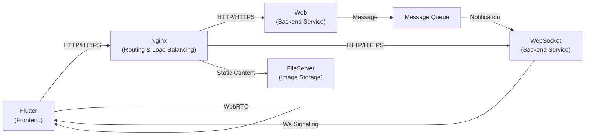
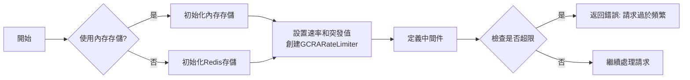
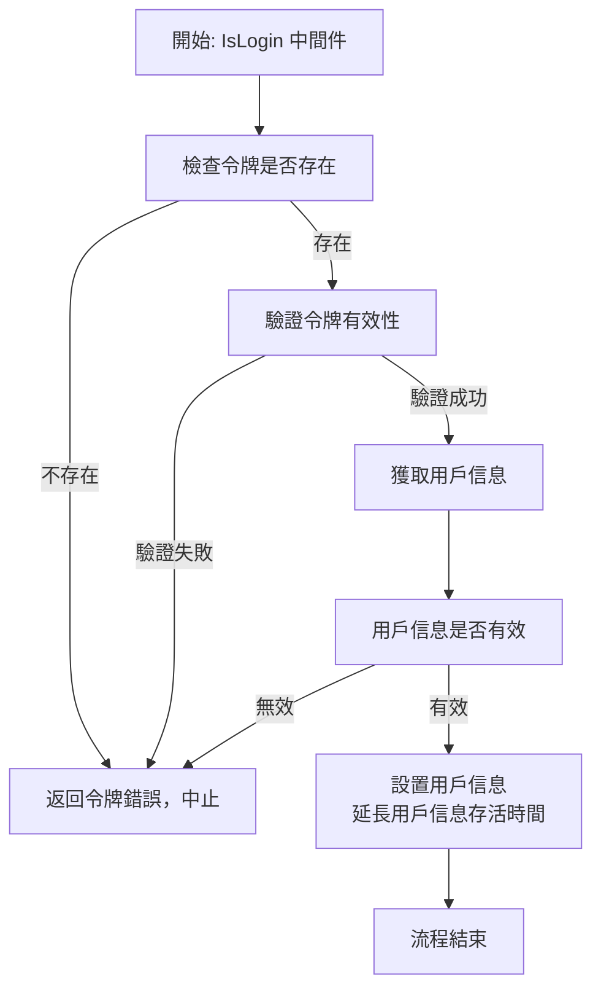

[TOC]

# im
instant message project

## 預計架構

- 實現下方WebRTC, Web, WebSocket端



## 套件相關

- [套件使用範例](./docs/md/note.md)
- [Validation使用](./docs/bi/binding.md)
- [prometheus監控](./docs/bi/prom.md)

## 專案結構

```
├─ api - 可能包含API相關的代碼。
├─ build - 與構建過程相關的配置和腳本。
│  ├─ mysql - MySQL的構建文件和配置。
│  └─ redis - Redis的構建文件和配置。
├─ cmd - 應用程式的入口點。
│  └─ web - Web應用程式或服務啟動代碼。
├─ config - 包含配置文件。
├─ deployments - 部署相關的配置和腳本。
│  └─ local - 本地部署配置。
├─ docs - 專案文檔。
│  ├─ bi - 商業智能文檔。
│  ├─ md - Markdown文件。
│  └─ sql - 與SQL相關的文檔。
│     ├─ dml - Data Manipulation Language文檔。
│     └─ init - 初始化SQL腳本。
├─ internal - 專案核心代碼，不對外暴露。
│  ├─ handler - HTTP請求處理器。
│  ├─ middleware - 中間件代碼。
│  ├─ models - 模型定義。
│  │  ├─ req - 請求結構。
│  │  └─ resp - 響應結構。
│  ├─ pkg - 共用套件或庫。
│  │  ├─ cache - 緩存相關功能。
│  │  ├─ config - 配置處理功能。
│  │  ├─ consts - 常量和枚舉。
│  │  │  ├─ enums - 枚舉類型。
│  │  │  └─ rediskey - Redis鍵的定義。
│  │  ├─ localcache - 本地緩存功能。
│  │  ├─ logger - 日誌記錄功能。
│  │  ├─ mongo - MongoDB的相關操作。
│  │  ├─ queue - 實現queue的初始化。含本地queue / redis queue / kafka
│  │  ├─ ratelimit - 速率限制功能。
│  │  ├─ rcache - 遠程緩存功能。
│  │  ├─ redis - Redis的相關操作。
│  │  └─ sqldb - SQL數據庫的相關操作。
│  ├─ provider - 提供者模式代碼。
│  ├─ repository - 資料存取層代碼。
│  │  ├─ mock_repository - 模擬存儲庫。
│  │  └─ sql - SQL存取代碼。
│  ├─ router - 路由設定。
│  ├─ server - 伺服器設定和啟動代碼。
│  ├─ service - 業務邏輯層。
│  └─ util - 工具類和助手函數。
│     ├─ crypto - 加密和解密工具。
│     ├─ ctxs - 上下文處理工具。
│     ├─ errs - 錯誤處理和定義。
│     ├─ network - 網絡相關工具。
│     ├─ stringutil - 字串處理工具。
│     └─ uuid - UUID生成工具。
├─ scripts - 開發、構建、部署腳本。
└─ template - 模板文件。
   └─ nunu - 特定的模板或模板集。
```

## 引用套件

|    | 套件                                   | 套件版本            | 說明                                          |
|----| -------------------------------------- | ------------------- |---------------------------------------------|
| 1  | github.com/DATA-DOG/go-sqlmock         | v1.5.0              | 用於在測試中模擬SQL數據庫的庫，不需要實際的數據庫連接。               |
| 2  | github.com/coocood/freecache           | v1.2.4              | 高性能的內存緩存庫。                                  |
| 3  | github.com/dtm-labs/rockscache         | v0.1.1              | 一個分佈式緩存解決方案。                                |
| 4  | github.com/fsnotify/fsnotify           | v1.7.0              | 用於監控文件系統通知的庫。                               |
| 5  | github.com/gin-contrib/cors            | v1.4.0              | 用於Gin框架的跨源資源共享(CORS)中間件。                    |
| 6  | github.com/gin-contrib/pprof           | v1.4.0              | Gin框架的pprof(性能分析)中間件。                       |
| 7  | github.com/gin-gonic/gin               | v1.9.1              | 一個高性能的HTTP web框架。                           |
| 8  | github.com/go-co-op/gocron             | v1.35.2             | 用於Go的簡單、流暢的定時任務庫。                           |
| 9  | github.com/go-playground/validator/v10 | v10.16.0            | 用於結構和字段驗證的庫。                                |
| 10 | github.com/go-redsync/redsync/v4       | v4.10.0             | 提供分佈式系統中的分佈式鎖定機制。                           |
| 11 | github.com/go-sql-driver/mysql         | v1.7.1              | MySQL數據庫的驅動程序。                              |
| 12 | github.com/goccy/go-json               | v0.10.2             | 用於JSON的高效解析和序列化庫。                           |
| 13 | github.com/gofrs/uuid                  | v4.4.0+incompatible | 用於生成和處理UUID的庫。                              |
| 14 | github.com/golang-jwt/jwt/v5           | v5.0.0              | 用於處理JSON Web Tokens (JWT)的庫。                |
| 15 | github.com/jinzhu/copier               | v0.4.0              | 用於在Go結構體之間進行深拷貝的庫。                          |
| 16 | github.com/prometheus/client_golang    | v1.17.0             | Prometheus的Go客戶端庫，用於監控和度量。                  |
| 17 | github.com/redis/go-redis/v9           | v9.2.1              | Redis的Go客戶端庫。                               |
| 18 | github.com/spf13/viper                 | v1.17.0             | 用於處理應用配置(設定檔)的庫。                            |
| 19 | github.com/stretchr/testify            | v1.8.4              | 用於撰寫測試的庫，提供了許多有用的斷言和輔助方法。                   |
| 20 | github.com/swaggo/swag                 | v1.16.2             | 自動生成Swagger 2.0文檔的庫。                        |
| 21 | github.com/throttled/throttled/v2      | v2.12.0             | 提供速率限制和限流功能的庫。                              |
| 22 | go.mongodb.org/mongo-driver            | v1.12.1             | MongoDB的Go驅動。                               |
| 23 | go.uber.org/dig                        | v1.17.1             | 用於依賴注入的庫。                                   |
| 24 | go.uber.org/zap                        | v1.26.0             | 一個快速、結構化、級別化的日誌框架。                          |
| 25 | golang.org/x/sync                      | v0.5.0              | 提供額外的同步套件，如semaphore、singleflight、errgroup。 |
| 26 | gorm.io/gorm                           | v1.25.5             | SQL的ORM庫                                    |
| 27 | github.com/ThreeDotsLabs/watermill     | v1.3.5              | 事件驅動套件。方便於Queue的實現切換。                       |
| 28 | github.com/IBM/sarama                  | v1.42.1             | Kafka用戶端套件                                  |


## 程序業務

### 中間件

#### RouteCache 

- 路由根據url設定緩存
- 設置RouteCache不會有route參數以外的其餘參數
- 流程圖
  ```mermaid
  graph TD;
  C[嘗試獲取緩存數據]
  C -->|緩存命中| D[返回緩存數據並中止]
  C -->|緩存未命中| E["進入SingleFlight (Redis級別)"]
  E --> F[嘗試獲取Redis數據]
  F -->|Redis命中| G[設置緩存數據, 返回Redis數據]
  F -->|Redis未命中| H["進入SingleFlight (DB級別)"]
  H --> I[獲取DB數據]
  I --> J[設置Redis和緩存數據]
  J --> K[返回DB數據]
  ```

#### Ratelimit

- 限制用戶ip登入次數
- 視條件更改所有


#### 登入驗證(JWT)



## 套件安裝

```shell
# 使用模板生成代碼
go install github.com/rickylin614/nunu@v1.0.4
# 生成測試代碼
go install github.com/vektra/mockery/v2@v2.36.0
# 生成文件
go install github.com/swaggo/swag/cmd/swag@v1.16.1
# 執行taskfile
go install github.com/go-task/task/v3/cmd/task@v3.32.0
```

## 執行標籤

- 使gin的json編碼使用非基礎套件:
  - tags加上`go_json`, 會使用`github.com/goccy/go-json`

## API介紹

[API說明](./docs/md/router.md)
